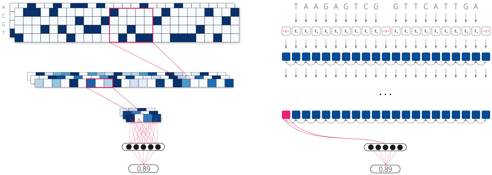

# Efficient approximation of DNA hybridisation using deep learning

Deoxyribonucleic acid (DNA) has shown great promise in enabling computational applications, most notably in the fields of DNA data storage and DNA computing. The former exploits the natural properties of DNA, such as high storage density and longevity, for the archival of digital information, while the latter aims to use the interactivity of DNA to encode computations. Recently, the two paradigms were jointly used to formulate the *near-data processing* concept for DNA databases, where the computations are performed directly on the stored data. The fundamental, low-level operation that DNA naturally possesses is that of hybridisation, also called annealing, of complementary sequences. Information is encoded as DNA strands, which will naturally bind in solution, thus enabling search and pattern-matching capabilities. Being able to control and predict the process of hybridisation is crucial for the ambitious future of the so-called *Hybrid Molecular-Electronic Computing*. Current tools are, however, limited in terms of throughput and applicability to large-scale problems.

In this work, we present the first comprehensive study of machine learning methods applied to the task of predicting DNA hybridisation. For this purpose, we introduce a synthetic hybridisation dataset of over 2.5 million data points, enabling the use of a wide range of machine learning algorithms, including the latest in deep learning. Depending on the hardware, the proposed models provide a reduction in inference time ranging from one to over two orders of magnitude compared to the state-of-the-art, while retaining high fidelity. We then discuss the integration of our methods in modern, scalable workflows.
