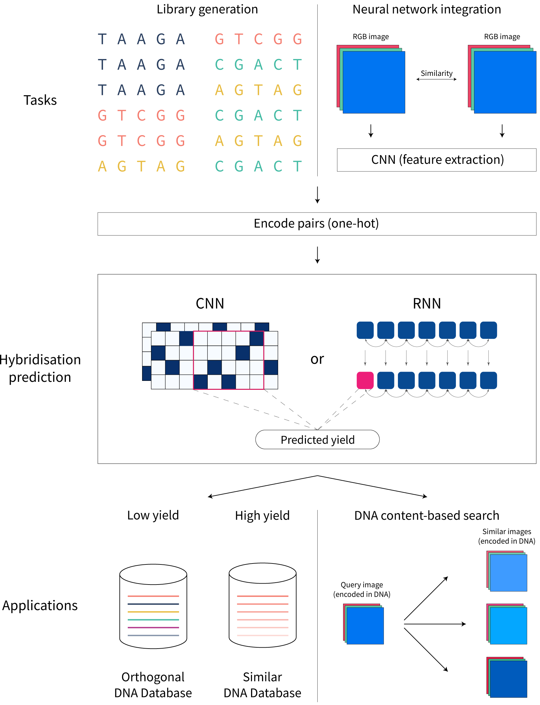

# Scaling up DNA digital data storage by efficiently predicting DNA hybridisation using deep learning


## Abstract

Deoxyribonucleic acid (DNA) has shown great promise in enabling computational applications, most notably in the fields of DNA data storage and DNA computing. The former exploits the natural properties of DNA, such as high storage density and longevity, for the archival of digital information, while the latter aims to use the interactivity of DNA to encode computations. Recently, the two paradigms were jointly used to formulate the *near-data processing* concept for DNA databases, where the computations are performed directly on the stored data. The fundamental, low-level operation that DNA naturally possesses is that of hybridisation, also called annealing, of complementary sequences. Information is encoded as DNA strands, which will naturally bind in solution, thus enabling search and pattern-matching capabilities. Being able to control and predict the process of hybridisation is crucial for the ambitious future of the so-called *Hybrid Molecular-Electronic Computing*. Current tools are, however, limited in terms of throughput and applicability to large-scale problems.

In this work, we present the first comprehensive study of machine learning methods applied to the task of predicting DNA hybridisation. For this purpose, we introduce a synthetic hybridisation dataset of over 2.5 million data points, enabling the use of a wide range of machine learning algorithms, including the latest in deep learning. Depending on the hardware, the proposed models provide a reduction in inference time ranging from one to over two orders of magnitude compared to the state-of-the-art, while retaining high fidelity. We then discuss the integration of our methods in modern, scalable workflows.

## Publication

The paper is now published in [*Nature Scientific Reports*](https://www.nature.com/articles/s41598-021-97238-y).

BibTeX citation:
```
@Article{Buterez2021,
author={Buterez, David},
title={Scaling up DNA digital data storage by efficiently predicting DNA hybridisation using deep learning},
journal={Scientific Reports},
year={2021},
month={Oct},
day={15},
volume={11},
number={1},
pages={20517},
abstract={Deoxyribonucleic acid (DNA) has shown great promise in enabling computational applications, most notably in the fields of DNA digital data storage and DNA computing. Information is encoded as DNA strands, which will naturally bind in solution, thus enabling search and pattern-matching capabilities. Being able to control and predict the process of DNA hybridisation is crucial for the ambitious future of Hybrid Molecular-Electronic Computing. Current tools are, however, limited in terms of throughput and applicability to large-scale problems. We present the first comprehensive study of machine learning methods applied to the task of predicting DNA hybridisation. For this purpose, we introduce an in silico-generated hybridisation dataset of over 2.5 million data points, enabling the use of deep learning. Depending on hardware, we achieve a reduction in inference time ranging from one to over two orders of magnitude compared to the state-of-the-art, while retaining high fidelity. We then discuss the integration of our methods in modern, scalable workflows.},
issn={2045-2322},
doi={10.1038/s41598-021-97238-y},
url={https://doi.org/10.1038/s41598-021-97238-y}
}
```

## Sequence computation scripts

There are three basic scripts provided:

1. Alignment computations with parasail: `dataset_utils/demos/parasail_demo.ipynb`
2. Sequential yield computation with NUPACK: `dataset_utils/nupack_thermo.ipynb`
3. Multithreaded yield computation with NUPACK: `nupack_thermo_multithreaded.ipynb`

## Requirements

NUPACK 3.2.2 was used for this project. It is possible to compile executables for both Windows and Linux.

Registration is needed on the official website: http://www.nupack.org/


For the dataset preparation scripts and the rest of the code, the recommended packages are:

`numpy pandas scikit-learn biopython p_tqdm`

These can be installed as follows:

` conda create --name py3.9 python=3.9`

`conda install -c conda-forge pandas numpy scikit-learn`

`pip install biopython p_tqdm`


`parasail` is not needed to run the code or train the models, but is needed for the classical ML algorithms (not deep learning) if using different/new sequences. The tested versions are 2.4.1 and 2.4. To install, follow the instructions of the official repository: https://github.com/jeffdaily/parasail#compiling-and-installing

The tested `MMseqs2` version is 9-d36de, newer versions were not tested. Installation instructions that leverage specific hardware features are provided on the official repository: https://github.com/soedinglab/MMseqs2#installation

For GPU-accelerated versions of algorithms such as Random Forests, try [RAPIDS.AI](https://rapids.ai/start.html#get-rapids).


### Deep learning

All recent PyTorch versions should work (tested 1.7.0+), with the corresponding recent CUDA versions for GPUs. PyTorch Lightning 1.1.0+ should also work (tested 1.1.4 and 1.1.6).


Some NLP libraries might also need to be installed, depending on the model.

To summarise, the essential packages for deep learning are:

`pytorch pytorch-lightning pytorch-nlp transformers`

The tested Hugging Face `transformers` version is `4.2.0.dev0`, with `tokenizers-0.9.4`.


For easy loading of the provided datasets from .h5, [deepdish](https://github.com/uchicago-cs/deepdish) is used.

`deepdish` is not a hard dependency and can be replaced with loading the provided data from .csv.


For neural network hyperparameter search, the [Optuna](https://optuna.org/) library is used.


For visualisation of results/metrics such as the confusion matrix, [seaborn](https://seaborn.pydata.org/) is used.


### Google TPUs

To run code on Google Colab TPUs, run the following code (working as of 30-07-2021):

`!pip uninstall torchtext -y`

`!pip install torch==1.7.1 torchvision==0.8.2 torchaudio==0.7.2`

`!pip install torchtext==0.8`

`!pip install cloud-tpu-client==0.10 https://storage.googleapis.com/tpu-pytorch/wheels/torch_xla-1.7-cp37-cp37m-linux_x86_64.whl`

`!pip install pytorch-lightning==1.1.6`


Newer versions of PyTorch might behave differently on TPUs since the implementation is not definitive yet.


